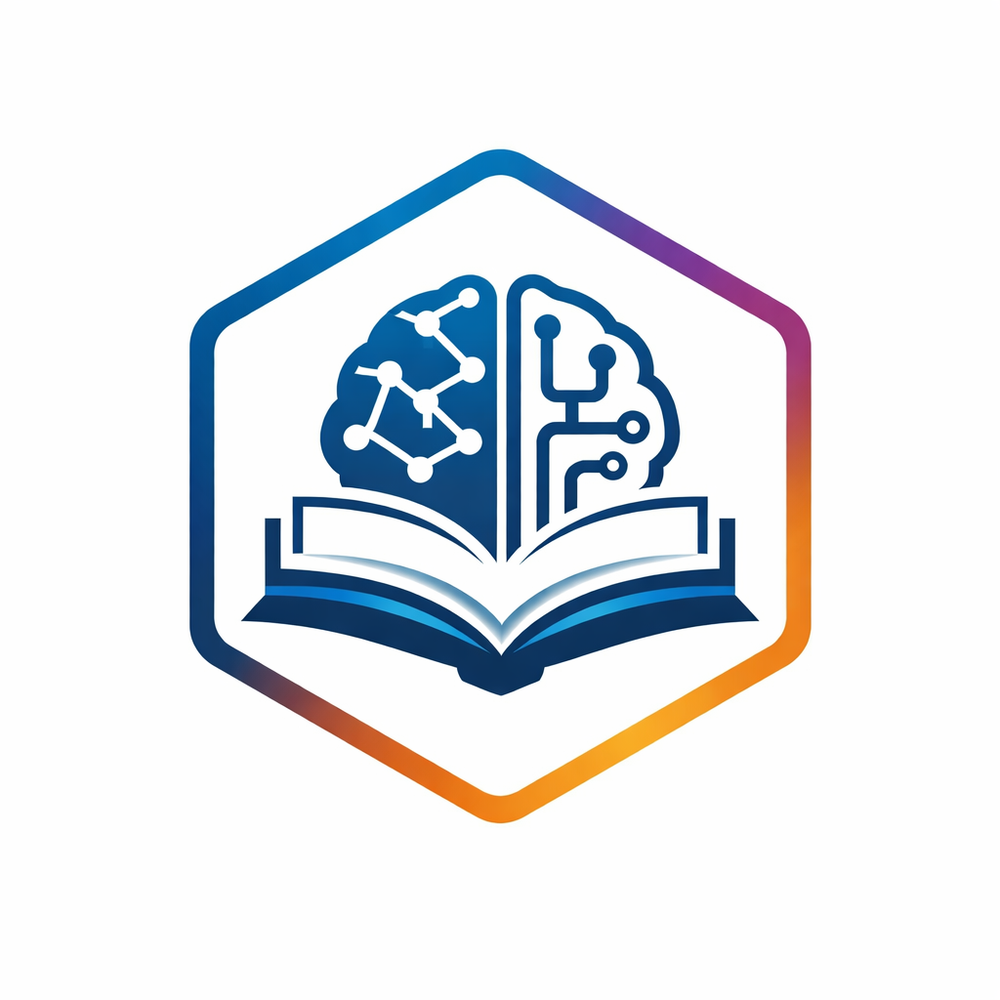

# Awesome TLA 

  

Standards-based infrastructure for tracking learning activities, managing 
competencies, and maintaining learner records across defense, workforce 
development, and education systems.

The Total Learning Architecture (TLA) originated from the U.S. Department of Defense Advanced
Distributed Learning (ADL) Initiative and has transitioned to IEEE LTSC for formal standardization. TLA
encompasses multiple interconnected standards enabling organizations to build interoperable, adaptive
learning systems.

## Contents

- [Standards and Specifications](#standards-and-specifications)
- [Core Technologies](#core-technologies)
- [Reference Implementations](#reference-implementations)
- [Tools and Libraries](#tools-and-libraries)
- [Developer Resources](#developer-resources)
- [Community](#community)
- [Related Standards Bodies](#related-standards-bodies)

## Standards and Specifications

### IEEE LTSC Standards
- [IEEE 9274.1.1-2023](https://standards.ieee.org/ieee/9274.1.1/7321/) - xAPI (Experience API) using
JSON and RESTful data transport.
- [IEEE 1484.20.3-2022](https://standards.ieee.org/ieee/1484.20.3/10749/) - Data Model for Shareable
Competency Definitions.
- [IEEE 1484.2-2024 (PESC LER alignment)](https://standards.ieee.org/ieee/1484.2/11164/) - Recommended Practice for Learning and Employment
Record (LER) Ecosystems.
- [IEEE 2881-2025](https://standards.ieee.org/ieee/2881/11719/) - Learning Metadata Terms.
- [IEEE 1484.12.1-2020](https://standards.ieee.org/ieee/1484.12.1/7699/) - Learning Object Metadata.
- [IEEE 1484.11.1-2022](https://standards.ieee.org/ieee/1484.11.1/10324/) - Data Model for Content
Object Communication.
- [IEEE 1484.11.2-2020](https://standards.ieee.org/ieee/1484.11.2/7698/) - ECMAScript API for Content
to Runtime Services Communication.
- [IEEE 1484.20.2-2022](https://standards.ieee.org/ieee/1484.20.2/10743/) - Recommended Practice for Defining Competencies.
- [IEEE 2247.4-2025](https://standards.ieee.org/ieee/2247.4/10368/) - Recommended Practice for Ethically Aligned Design of Artificial Intelligence (AI) in Adaptive Instructional Systems.

### ISO/IEC Standards
- [ISO/IEC/IEEE 39274-1-1:2025 – Experience API (xAPI)](https://www.iso.org/standard/91131.html) - Joint IEEE/ISO standardization of the Experience API for international adoption and harmonization, published October 2025.

### Working Group Standards (In Development)
- [P9274.2.1 - xAPI Profiles](https://sagroups.ieee.org/9274-2-1/) - JSON-LD specification for defining application profiles that extend xAPI for specific learning contexts.
- [P9274.3.1](https://sagroups.ieee.org/9274-3-1/) - Packaging, Launch, and Run-time of xAPI (cmi5) - Standard for launching xAPI content from learning management systems with session management.
- [P9274.4.2](https://sagroups.ieee.org/p9274-4-2/) - Cybersecurity in xAPI Implementation - Security requirements and best practices for protecting learner data in xAPI systems.
- [P2247.2](https://sagroups.ieee.org/p2247-2/) - Adaptive Instructional Systems Interoperability - Standards for adaptive learning systems that personalize instruction based on learner needs.
- [P2834](https://sagroups.ieee.org/2834/) - Secure and Trusted Learning Systems - Security and privacy frameworks for learning technology infrastructure.
- [P2834.1](https://sagroups.ieee.org/p2834-1/) - Digital Forensics on Trusted Learning Systems - Technical requirements for forensic-investigation-ready learning systems, including evidence collection, preservation, and audit trails.
- [P2997](https://sagroups.ieee.org/p2997/) - Enterprise Learner Record - Comprehensive learner record standard integrating learning, employment, and credential data.
- [P1484.20.3a](https://standards.ieee.org/ieee/1484.20.3a/12109/) - Shareable Competency Definitions Amendment: Open Source - Brings IEEE 1484.20.3 into IEEE SA Open and adds supporting documents such as application profiles and clearer rubric definitions.

## Core Technologies

### xAPI (Experience API)
- [xAPI Specification](https://github.com/adlnet/xAPI-Spec) - Official repository for the Experience API (xAPI) specification defining standard for tracking learning experiences.
- [xAPI Profiles](https://github.com/adlnet/xapi-profiles) - Specification and tools for creating application-specific extensions to xAPI for specialized learning contexts.

### Competency Frameworks
- [Competency and Skills System (CaSS)](https://github.com/cassproject) - Open-source platform for managing competency frameworks, assessments, and learning pathways aligned with IEEE 1484.20.3 management.
- [IEEE 1484.20.3 SCD Working Repository](https://opensource.ieee.org/ltsc/scd-staging) - IEEE SA Open repository for the Shareable Competency Definitions working group's in-progress (non-normative) materials.

### Learning Record Stores (LRS)
- [SQL LRS](https://github.com/yetanalytics/lrsql) - Production-grade Learning Record Store with PostgreSQL backend, DoD Platform One certified.
- [ADL LRS](https://github.com/adlnet/ADL_LRS) - Reference Learning Record Store implementation from the Advanced Distributed Learning Initiative.
- [ADL LRS Conformance test Suite](https://github.com/adlnet/lrs-conformance-test-suite) - A Node.js project that tests the MUST requirements of the xAPI Spec and is based on the ADL testing requirements repository.
- [Local LRS Server](https://github.com/gowithfloat/Float.TinCan.LocalLRSServer) - A local LRS server for xAPI client applications.
- [Ralph](https://github.com/openfun/ralph) - Open-source Python toolbox that works as a Learning Record Store, an xAPI statement API server, and a library/CLI for learning analytics.

## Reference Implementations

### xAPI Tools

- [cmi5 Advanced Testing Application and Player Underpinning Learning Technologies (CATAPULT)](https://github.com/adlnet/CATAPULT) - Conformance testing suite for cmi5 Assignable Units and Learning Record Stores.
- [xAPI cmi5 profile using JavaScript.](https://github.com/xapijs/cmi5) - Communicate over the xAPI cmi5 profile using JavaScript.
- [xAPI adapter for Unity](https://github.com/e-ucm/xasu-unity) - xAPI Analytics Submitter for Unity / A very simple xAPI tracker with cmi5 support.
- [cmi5 Launch for Moodle](https://github.com/adlnet/Moodle-mod_cmi5launch) -  A Moodle plugin which allows teachers to upload cmi5 packaged lessons within a Moodle Course Activity and then assign the activity to students.
- [RapidCMI5 Course Creation Tools](https://github.com/ByLightSDC/rapidcmi5) - RapidCMI5 is a CMI5 course creation toolset.
- [Learning Records Converter (Prometheus-X)](https://github.com/Prometheus-X-association/learning-records-converter) - Learning Records Converter is a tool enabling the interoperability of Learning Records in various formats (xAPI, SCORM, IMS Caliper, cmi5, proprietary).
- [xAPI Video Profile Reference Project](https://github.com/jhaag75/xapi-videojs) - Example of xAPI Video Profile with the HTML5 / VideoJS Library.
- [xAPI LRS Auth Proxy](https://github.com/tla-ecosystem/xapi-lrs-auth-proxy) - Reference authentication proxy for cmi5/xAPI that issues session-scoped JWTs and enforces cmi5 actor, activity, and registration permissions in front of any LRS.
- [xAPI.js](https://github.com/xapijs/xapi) - TypeScript/JavaScript library for communicating with a Learning Record Store over xAPI.
- [Moodle Logstore xAPI](https://github.com/davidpesce/moodle-logstore_xapi) - Moodle plugin that emits xAPI statements to an LRS from Moodle logstore events.
- [LRSPipe](https://github.com/yetanalytics/xapipe) - Middleware that forwards xAPI statements between LRSs, with data flow governed by xAPI Profiles.
- [DATASIM](https://github.com/yetanalytics/datasim) - Generates simulated xAPI data at scale from xAPI Profiles for testing TLA applications.
  
### Sharable Competency Definition (SCD)
- [TLA Toolbox](https://tlatoolbox.com) - Community platform for creating, managing, and sharing competency definitions and xAPI profiles.

### Enterprise Learner Record (ELRR)
- [ELRR Documentation](https://github.com/adlnet/elrr-documentation) - ADL's Enterprise Learner Record Repository, implementing the IEEE P2997 data model and Learner API and updating learner records from xAPI statements.

## Tools and Libraries

### Development Tools
- [SCORM Cloud (Rustici Software)](https://rusticisoftware.com/products/scorm-cloud/) - Commercial SCORM, xAPI, and cmi5 content hosting and testing platform with conformance validation platform.

## Developer Resources

### Documentation
- [xAPI v2.0.0 (P9274.1.1) Documentation](https://opensource.ieee.org/xapi/xapi-base-standard-documentation)  - Official documentation, specifications, and implementation guides for the Experience API.
- [IEEE LTSC GitLab Resources](https://opensource.ieee.org/ltsc) - IEEE Learning Technology Standards Committee GitLab artifacts and documentation for TLA-related standards.
- [cmi5 Specification](https://github.com/AICC/CMI-5_Spec_Current) - Profile for using xAPI with traditional learning management system launch and tracking workflows.
- [xAPI Base Standard Examples](https://opensource.ieee.org/xapi/xapi-base-standard-examples) - IEEE SA Open examples accompanying the IEEE 9274.1.1 xAPI base standard, including PUT and POST request examples.
- [cmi5 Working Repository (P9274.3.1)](https://opensource.ieee.org/ltsc/cmi5-staging) - IEEE SA Open repository for the working group standardizing cmi5 as P9274.3.1 (non-normative work in progress).
- [xAPI Profiles Working Repository (P9274.2.1)](https://opensource.ieee.org/ltsc/xapi-profiles-staging) - IEEE SA Open repository for the P9274.2.1 xAPI Profiles working group (non-normative work in progress).
- [DoDI 1322.26 Reference](https://adlnet.github.io/dodireference/) - ADL's implementation reference for DoD Instruction 1322.26 (Distributed Learning), defining the learning data standards required across DoD systems.

### Other Standards of Interest
- [1EdTech Security Framework](https://www.imsglobal.org/spec/security/v1p0) - OAuth 2.0 security and authentication framework for learning technology applications and APIs.
- [1EdTech Open Badges 3.0](https://www.imsglobal.org/spec/ob/v3p0) - Verifiable digital badge format aligned with the W3C Verifiable Credentials data model.
- [1EdTech Comprehensive Learner Record (CLR) 2.0](https://www.imsglobal.org/spec/clr/v2p0) - Verifiable, machine-readable record of a learner's achievements from multiple providers, built on W3C Verifiable Credentials alongside Open Badges 3.0.
- [1EdTech CASE 1.1](https://www.imsglobal.org/spec/case/v1p1) - Competencies and Academic Standards Exchange for publishing and exchanging machine-readable competency frameworks.
- [1EdTech LTI 1.3](https://www.imsglobal.org/spec/lti/v1p3) - Learning Tools Interoperability core specification for securely launching external tools from learning platforms.

### Tutorials and Guides
- [xAPI Developer Guide](https://xapi.com/developer-overview/) - Step-by-step guide for implementing xAPI in learning applications and content.
  
## Community

### Discussion Forums
- [xAPI Community](https://groups.google.com/a/adlnet.gov/g/xapi-spec) - ADL's Google Group archive of xAPI specification development and implementation discussions.
- [TLA Community Forum](https://discuss.tlaworks.com) - Discussion forum for TLA practitioners, implementers, and standards contributors.

### Events and Working Groups
- [IEEE LTSC Active Working Groups](https://sagroups.ieee.org/ltsc/workgroups/) - Regular Working Groups and meetings of IEEE LTSC for standards development and community coordination.
- [IEEE ICICLE](https://sagroups.ieee.org/icicle/) - IEEE LTSC consortium advancing learning engineering as a profession and discipline, with monthly community calls and special/market interest groups.
- [Learning Impact Conference Hosted by 1EdTech Consortium](https://www.1edtech.org/events) - Annual conference hosted by 1EdTech Consortium on learning technology innovation and interoperability.

## Related Standards Bodies

### International Organizations
- [IEEE Learning Technology Standards Committee (LTSC)](https://sagroups.ieee.org/ltsc/)
- [ISO/IEC JTC1 SC36](https://www.iso.org/committee/45392.html) - Information technology for learning, education and training.
- [1EdTech Consortium](https://www.1edtech.org/) - Global learning technology consortium developing interoperability standards for education and workforce development.
- [W3C](https://www.w3.org/) - World Wide Web Consortium developing web standards including JSON-LD and RDF used in learning metadata.

### Industry and Education Organizations
- [Advanced Distributed Learning Initiative (ADL)](https://github.com/adlnet) - U.S. DoD organization (now sunset) that originated xAPI and the TLA; its open-source tools and specifications remain available on GitHub.
- [I2IDL](https://www.i2idl.org/) - Institute for Infrastructure and Interoperable Data in Learning, a not-for-profit entity stood up to become a steward maintaining repositories created by the Advanced Distributed Learning (ADL) Initiative, whose open-source IP was paid for by US taxpayers.
- [HR Open Standards Consortium](https://www.hropenstandards.org/) - Standards organization developing HR and workforce data specifications complementary to learning records.
- [Credential Engine](https://credentialengine.org/) - Registry of credentials, competencies, and learning opportunities using linked open data standards.
- [PESC](https://www.pesc.org/) - Standards organization for education data exchange including learning and employment records.

## Contributing

Contributions are welcome! Please read the [contribution guidelines](CONTRIBUTING.md) first.

To add a resource:
1. Fork this repository
2. Add your resource to the appropriate section
3. Ensure it follows the [Awesome List
guidelines](https://github.com/sindresorhus/awesome/blob/main/contributing.md)
4. Submit a pull request

---

**Maintained by the TLA Ecosystem community**
'Awesome' concept proposed by Gregory Kulp | Initial curation by Henry Ryng
